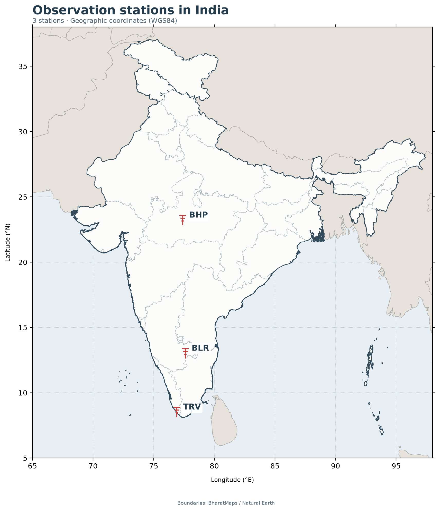

# India Station Map

Plot Indian state boundaries and observation stations with Python. By [Keshav Aggarwal](https://github.com/jovian-explorer), adapted from the original `map.ipynb` station-map notebook.



## Quick start

Requires Python 3.10 or newer. From this repository's folder:

```bash
python -m pip install -r requirements.txt
python india_map.py
```

The first run downloads boundary data into `data/` and saves `outputs/india_station_map.png`. Later runs reuse the cached files. Add `--offline` to prohibit downloads, or `--show` to display the plot interactively. A short notebook example is included in `map.ipynb` (requires Jupyter).

## Customize

```bash
python india_map.py --stations examples/stations.csv --output outputs/stations.pdf
python india_map.py --marker circle --title "My station network" --output outputs/stations.svg
python india_map.py --extent 72 85 6 26 --no-neighbors
python india_map.py --reference-curves --output outputs/reference_map.png
```

- Station CSV columns: `name,longitude,latitude`; optional `label_dx,label_dy` move labels in points. The three example coordinates are rounded values from the original notebook, not survey positions.
- PNG, PDF and SVG exports; `--dpi` controls raster resolution.
- Use `--india-boundaries PATH` and `--world-boundaries PATH` for your own georeferenced boundary files, or `--data-dir PATH` for another download cache.
- Coordinates are WGS84 longitude/latitude in degrees. Map proportions use the central latitude; this is a geographic plot, not an equal-area projection. The default extent includes the island groups.

## Data and reference curves

State geometry comes from [BharatMaps](https://github.com/Amazing-coder1203/BharatMaps) at commit `92a5898c67beea05fc76b008e042a1dcce081c2d`; neighboring countries come from [Natural Earth, 1:50m](https://www.naturalearthdata.com/downloads/50m-cultural-vectors/50m-admin-0-countries-2/). Boundary files are downloaded separately and retain their upstream terms and attribution. The map reflects those datasets, including their administrative vintage and boundary conventions; supply updated geometry when needed.

The optional curves in `examples/reference_curves.csv` preserve the numbers in the original notebook. Their IGRF version, epoch, altitude and derivation were not recorded. They are therefore off by default and labeled as reference curves. This tool does **not** compute IGRF or predict an EIA crest. The samples are connected directly, without introducing new polynomial fits.

## Checks

```bash
python -m unittest discover -s tests -v
```

Tests use small local geometries and do not download data.
